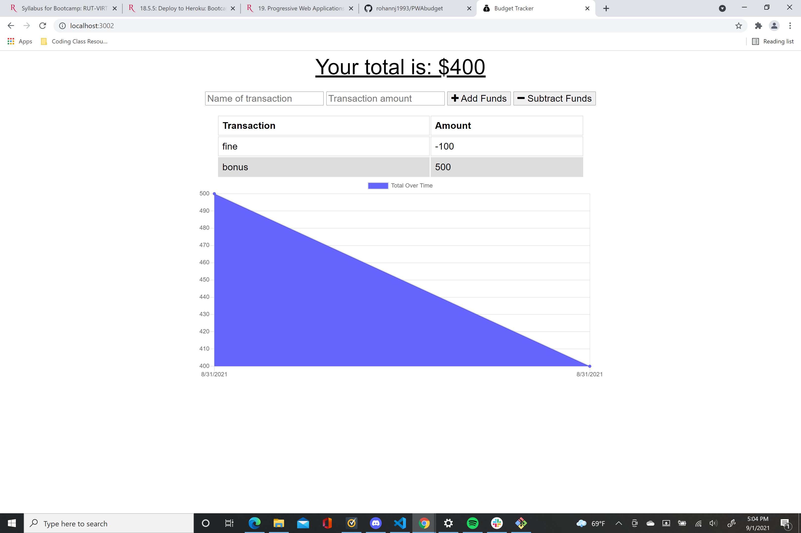
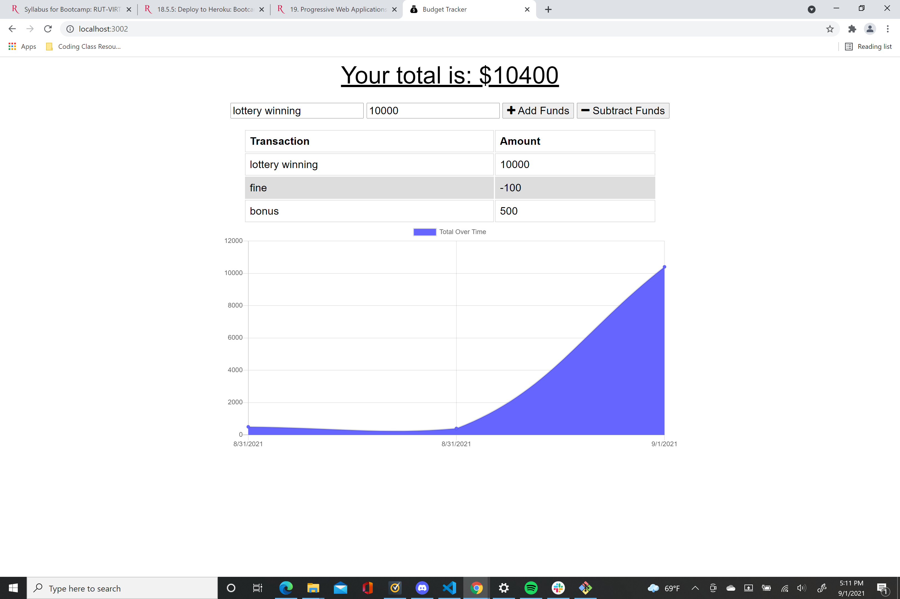

# Budget Tracker-
Our challenge was to update an existing budget tracker application to allow for offline access and functionality. The user of this application  will be able to add expenses and deposits to their budget with or without a internet connection. If the user enters transactions offline, the total should be updated when they're brought back online. 

## Technologies used-
Node.js

Javascript

Express

Mongoose
